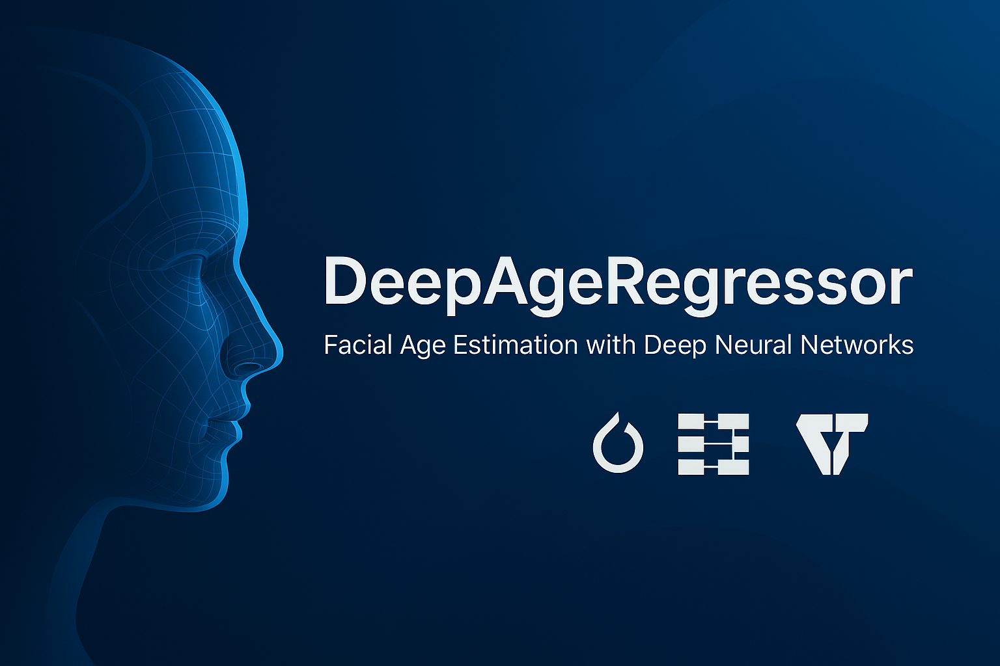

<!-- Banner -->
<p align="center">
  
</p>


<h1 align="center">DeepAgeRegressor</h1>

<p align="center">
  <b>Deep Learning-Based Facial Age Estimation</b><br>
  Regression models built with PyTorch to predict age from facial images.<br>
  <em>Designed with clarity, reproducibility, and research in mind.</em>
</p>

---

## 🚀 Overview

**DeepAgeRegressor** is a modular and scalable framework for predicting human age from facial images using deep neural networks. Unlike probabilistic or classification-based approaches, this repository focuses on **direct scalar regression**, employing powerful architectures such as ResNet, ResNeXt, and Vision Transformers.

It’s optimized for academic reproducibility and built to support experimentation for researchers and students aiming for real-world impact — ideal for internships and applied AI research.

---

## 🧠 Model Architectures

| Model          | Architecture         | Output       | Loss Functions             |
|----------------|----------------------|--------------|----------------------------|
| `ResNetAgeModel` | ResNet-50            | Continuous   | MSE, Weighted MSE          |
| `ResNext`        | ResNeXt-50 (32x4d)   | Continuous   | Soft-AAR, Weighted MSE     |
| `ViTAgeModel`    | ViT-B/16 Transformer | Continuous   | MSE                        |

---

## 🧾 Project Structure

```bash
deepage-regressor/
├── config/                 # YAML training configurations
├── data/                   # Dataset loading and transformation
├── models/                 # Model definitions (ResNet, ResNeXt, ViT)
├── loss/                   # Custom loss functions (Soft-AAR, Weighted MSE)
├── trainer/                # Training and validation loop
├── eval.py                 # Evaluation and inference
├── main.py                 # Training entry point
└── README.md
```

---

## 📦 Installation

Install the required Python packages:

```bash
pip install -r requirements.txt
```

---

## 📂 Dataset Format

Provide a CSV file with image paths and age labels:

```csv
image_path,age
images/subject1.jpg,23
images/subject2.jpg,45
```

Works out-of-the-box with:
- UTKFace
- FG-NET (with preprocessing)
- Custom datasets in similar format

---

## 🧪 Training

Start training with any supported architecture:

```bash
python main.py --config config/resnet.yaml
```

Use YAML to configure backbone, batch size, epochs, learning rate, and loss.

---

## 📊 Evaluation

Evaluate model performance on a test set:

```bash
python eval.py --checkpoint runs/model_best.pt --csv data/test.csv
```

---

## 📈 Example Results

| Model     | MAE ↓  | Notes                            |
|-----------|--------|----------------------------------|
| ResNet-50 | 1.36   | Standard MSE loss                |
| ResNeXt-50| 0.74   | Weighted MSE + Augmentation      |
| ViT-B/16  | 1.28   | Vision Transformer + MSE         |

> ✅ Best performance achieved using ResNeXt with augmentation and soft AAR loss.

---

## 🧮 Loss Functions

- **MSE**: Standard Mean Squared Error
- **Weighted MSE**: Emphasizes difficult age ranges
- **Soft-AAR**: Custom loss based on Age-Aware Reliability

---

## 🛠️ Example Configuration

```yaml
model:
  name: resnext
  pretrained: true

training:
  batch_size: 64
  epochs: 100
  lr: 0.0001

loss:
  type: weighted_mse
```

---

## 🎯 Goals

- ✅ Fast experimentation for academic research
- ✅ Easy integration of new models and losses
- ✅ High-quality baseline for facial age regression

---

## 📬 Contact

**Elham Soltani Kazemi**  
📫 [your.email@domain.com]  
🔗 [LinkedIn](https://linkedin.com/in/your-profile)

---

## 📄 License

MIT License. See `LICENSE` for more details.

---

<p align="center">
  Built with 💙 for impactful AI research.
</p>

---

## 🧪 Synthetic Data for Minor Age Groups

To address data scarcity in younger age brackets, we incorporated **LLM-guided diffusion-based synthetic images** for children (particularly ages 1–5). These samples were generated using Stable Diffusion conditioned on LLM-generated prompts for realistic age-specific variation.

### 👶 Synthetic Data Highlights
- 13,558 synthetic images of 1–5-year-olds
- Diverse ethnicities, lighting conditions, and facial expressions
- Generated using prompts via ChatGPT + Stable Diffusion (v1.5)

### 📈 Impact on Model Performance

| Model         | Dataset            | Age Range | MAE ↓   | Notes                           |
|---------------|--------------------|-----------|---------|---------------------------------|
| ResNeXt-50    | Real Only          | 1–5       | 2.14    | Baseline on real data only      |
| ResNeXt-50    | + Synthetic (LLM)  | 1–5       | 1.06    | With LLM-based synthetic boost  |
| ViT-B/16      | + Synthetic (LLM)  | 1–5       | 1.22    | Transformer performance improved|

> ✅ The inclusion of synthetic data halved the MAE for the 1–5 age group.

This demonstrates the **value of synthetic data generation** for age ranges underrepresented in real datasets.

---


